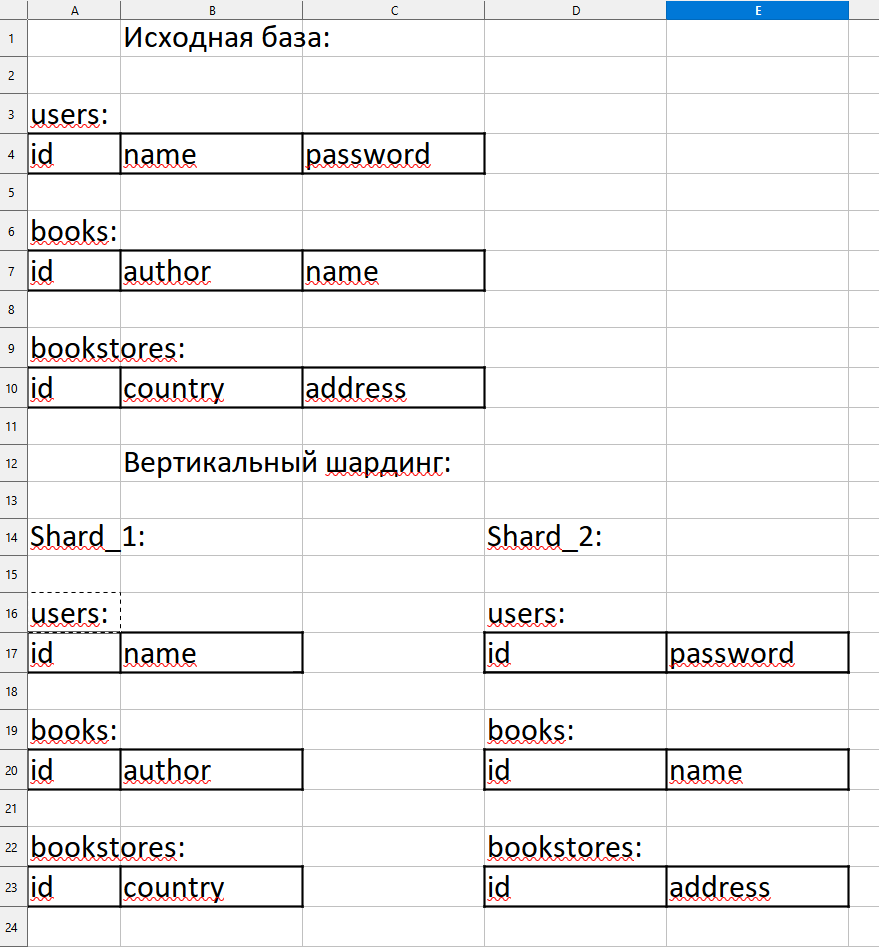
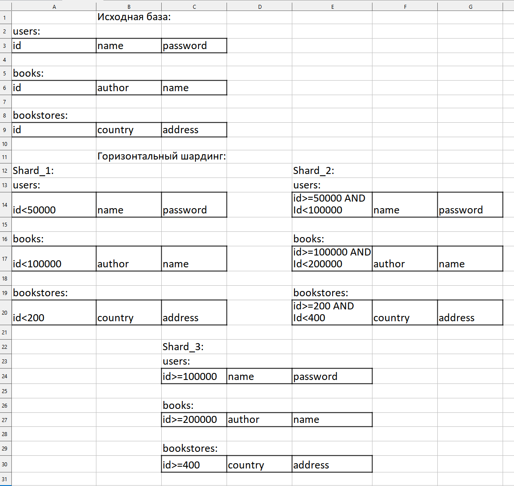

# Домашнее задание к занятию «Репликация и масштабирование. Часть 2» - Плеханов С.А.

### Задание 1

Опишите основные преимущества использования масштабирования методами:

- активный master-сервер и пассивный репликационный slave-сервер; 
- master-сервер и несколько slave-серверов;

*Дайте ответ в свободной форме.*

### Решение 1

1. Использование активного **master-сервера** и пассивного репликационного **slave-сервера** целесообразно использовать в качестве схемы резервирования с горячим резервом, например в кластерных решениях, т.к. пассивный репликационный  **slave-сервер** будет максимально быстро приведен в консистентное состояние, соответствующее **master-серверу**. Выход из строя **master-сервера** не приведет к потере данных и задержкам в восстановлении доступности системы.
2. Использование **master-сервера** и несколько **slave-серверов** целесообразно, когда на первом месте стоит производительность и при этом соотношение запросов на чтение данных и на изменение данных склоняется в сторону чтения. В этом случае **slave-серверы** существенно разгрузят **master-сервер** и увеличат производительность системы.

### Задание 2

Разработайте план для выполнения горизонтального и вертикального шаринга базы данных. База данных состоит из трёх таблиц: 

- пользователи, 
- книги, 
- магазины (столбцы произвольно). 

Опишите принципы построения системы и их разграничение или разбивку между базами данных.

*Пришлите блоксхему, где и что будет располагаться. Опишите, в каких режимах будут работать сервера.* 

### Решение 2

Схема вертикального шардинга:

Схема горизонтального шардинга:

